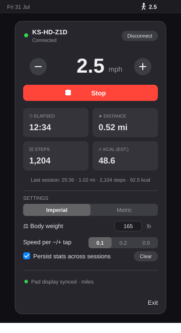

# Z1 WalkingPad — KingSmith WalkingPad Z1 Mac Control (Bluetooth FTMS, MCP, CLI)

> **macOS menu-bar app + Python MCP server + CLI for KingSmith WalkingPad Z1 (KS-HD-Z1D).** Reverse-engineered Bluetooth FTMS unlock, fully documented protocol, local-first walks, 1,500+ distance stories, highscores & achievements.

     

**Keywords:** `kingsmith walkingpad z1` · `walkingpad z1 mac` · `walkingpad bluetooth` · `FTMS treadmill macOS` · `walkingpad cli` · `walkingpad MCP` · `treadmill menu bar app` · `walkingpad API`

The WalkingPad Z1 (`KS-HD-Z1D`, firmware V0.0.6) speaks standard Bluetooth FTMS (`0x1826`) — but locks it behind a vendor unlock handshake that stops every generic client cold. This project cracked that gate and ships two independent, production-ready implementations around it:

- 🖥️ **macOS menu-bar app** — native SwiftUI, one-screen intro, silent re-sign, stays connected, 1,500 equivalences
- 🤖 **MCP server + CLI + Python library** — drive the treadmill from AI assistants (Claude, Kimi, …) or scripts — agent-readable `agent-data.json`

Everything is documented well enough to build your own client in any language: see the [protocol quick reference](#quick-reference-build-your-own-cheat-sheet).


The WalkingPad Z1 (`KS-HD-Z1D`, firmware V0.0.6) speaks standard Bluetooth FTMS — but locks it behind a vendor unlock handshake that stops every generic client cold. This project cracked that gate and ships two independent, production-ready implementations around it:

- 🖥️ **macOS menu-bar app** — native SwiftUI, lives in your menu bar, Apple-clean UI
- 🤖 **MCP server + CLI + Python library** — drive the treadmill from AI assistants (Claude, Kimi, …) or scripts

Everything is documented well enough to build your own client in any language: see the [protocol quick reference](#quick-reference-build-your-own-cheat-sheet).

## Features

- ▶️ Start / stop / pause, ±nudge steppers, and exact speed entry — type `3.1` or drag the slider (1.6–6.4 km/h)
- 📊 Live telemetry: speed, distance, elapsed time, **steps** — stable-window estimate that learns your stride-vs-speed curve and rejects implausible samples
- 🔥 Calorie estimate via the ACSM walking metabolic equation (research-backed; ±10–15%)
- 🧠 The pad is the master — app reflects reality even when you use the physical remote
- 🔁 Pad is the master for counters; calories and steps persist across reconnects (gap-credited) — or flip on "Persist stats across sessions" to accumulate until you hit Clear
- 😴 Exit stops the belt and puts the pad in standby
- 🔋 Zero measurable battery impact (0.0% CPU, 0.0 power score)
- 🇺🇸 Imperial/metric units, synced to the pad's own display (metric distances are always km — no metre/km switching)
- 📊 Configurable menu-bar readout (speed / elapsed / distance / steps / kcal / today's minutes / today's steps) and a daily goal — 120 minutes by default, or switch Settings to a step goal (8,000 by default)
- 🏆 Records & achievements: longest walk, farthest, most steps/kcal (walk + day), streaks, 19 badges — derived from history, never loses data on update
- 🤖 Agent-readable data: `agent-data.json` (Swift) + `~/.z1-walkingpad/agent-data.json` + MCP tools `highscores`/`achievements`/`daily_totals`/`agent_data` (schema v1)
- 📅 Walk history on disk: today's totals, a seven-day chart, and the last walks in the popover (walks shorter than 2 minutes are not recorded)
- 🌤️ Almanac card in the popover: click to toggle its tile strip between This week and 30 days (each tap resets the detail back to Today); every day renders as a small sky tile whose glow reflects that day's goal progress (sunrise/sunset computed locally, defaulting to Amersfoort, NL)
- 🔌 Built to stay connected: start at login, instant reconnect on wake, and no idle sleep while the belt moves
- 📝 Local session history as JSON on this Mac (no iCloud / Health / WHOOP queue by default)

## Quick start

### macOS menu-bar app



```bash
git clone https://github.com/fortun8te/z1-walkingpad.git
cd z1-walkingpad/macos
bash build-app.sh               # builds, stable codesign, ditto in place into /Applications (Bluetooth TCC survives rebuilds)
```

Launch it, click the `figure.walk` menu-bar icon → **Connect**. Requires only the macOS Command Line Tools — no Xcode, no Python.

### MCP server / CLI (Python)

```bash
uv venv --python 3.12 .venv
uv pip install --python .venv/bin/python -e ".[dev,mcp]"

.venv/bin/python -m z1_walkingpad_mcp start --speed 2.5    # CLI: start at 2.5 km/h
.venv/bin/python -m z1_walkingpad_mcp.server               # MCP: stdio server
```

MCP client config:

```json
{
  "mcpServers": {
    "z1-walkingpad": {
      "command": "/path/to/z1-walkingpad-mcp/.venv/bin/python",
      "args": ["-m", "z1_walkingpad_mcp.server"],
      "env": { "Z1_WEIGHT_KG": "80" }
    }
  }
}
```

Tools: `treadmill_status` · `treadmill_start` · `treadmill_set_speed` · `treadmill_speed_up` · `treadmill_speed_down` · `treadmill_pause` · `treadmill_stop` · `highscores` · `achievements` · `daily_totals` · `agent_data`


## SEO & discoverability

**Repo description (copy to GitHub → Settings → About):**
> KingSmith WalkingPad Z1 control for Mac — menu-bar app (SwiftUI) + Python MCP/CLI, reverse-engineered BLE FTMS unlock, local walk history, 1500+ equivalences, highscores & achievements.

**Suggested GitHub topics:** `kingsmith` `walkingpad` `walkingpad-z1` `treadmill` `bluetooth` `ble` `ftms` `macos` `swiftui` `menubar` `mcp` `claude` `health` `fitness` `walking-desk` `under-desk-treadmill`

**Search phrases this README targets:** KingSmith WalkingPad Z1 Mac app, WalkingPad Z1 Bluetooth Mac, FTMS treadmill control, WalkingPad Z1 API, WalkingPad MCP server, WalkingPad CLI.

**Social preview:** `docs/assets/popover.svg` + `docs/assets/og-walkingpad.png` (1200×630, add if missing).

**Indexing:** This README uses keyword-rich H1/H2, first-100-words summary, and structured Features/Quick start/Protocol sections for crawlers.

## Contents

- [The two frontends](#the-two-frontends)
- [Behavior nuances](#behavior-nuances-what-to-expect)
- [Usage](#usage)
- [Protocol](#how-it-works-the-protocol) — [quick reference](#quick-reference-build-your-own-cheat-sheet)
- [Health metrics](#health-metrics)
- [Development](#development)
- [Safety model](#safety-model)

## The two frontends

| | macOS menu-bar app | MCP server / CLI / Python lib |
|---|---|---|
| Purpose | Manual daily control | AI-assistant control and scripts |
| Code | Swift, CoreBluetooth (`macos/`) | Python, bleak (`src/z1_walkingpad_mcp/`) |
| Install | `bash build-app.sh --install` | `uv pip install -e ".[mcp]"` |
| Units | Imperial/metric setting (default Metric) | km/h + kg; `Z1_WEIGHT_KG` env |
| Session log | in-app summary | JSON in `~/.z1-walkingpad/` (or `Z1_SESSIONS_DIR`) |
| Settings | units, body weight, speed step, daily goal (minutes or steps) | env vars |

Both talk to the pad directly and independently — neither needs the other. **Only one BLE connection at a time**: quit the app (or stop the MCP server) before using the other.

## Behavior nuances (what to expect)

- **The pad is the master — of everything.** Belt state, time, distance, and steps are shown exactly as the pad reports them, however they were changed (app, remote, or the pad's own timer). When the pad resets its counters (on Stop, or on its own schedule), the display follows.
- **Calories are the one thing we compute** (the pad reports none) — but they follow the same lifecycle: the estimate resets when the pad's counters reset, so the numbers never disagree about what "this session" is.
- **Calories and steps persist across reconnects.** Saved every second; disconnect while the belt is still moving and both counts continue, with the disconnected gap estimated (avg-speed calories, stride-based steps) — because the pad's session never ended.
- **Want a trip odometer instead?** Settings → **Persist stats across sessions** makes time/distance/steps/kcal keep accumulating across Stops (the pad's resets are folded in) until you hit the **Clear** button beside it. Off = pad-as-master.
- **Step counts are corrected, not just relayed.** At ≥3 km/h the app preserves every raw step but learns only from stable 12-second windows. It requires at least three accepted windows and 100 m, rejects impossible stride lengths, then derives slow-speed steps from belt distance. Until then it keeps a continuous raw total.
- **Start on a moving belt is a no-op** (the pad refuses it) — `start()` skips the command when the belt is already moving.
- **Exit stops the belt and sleeps the pad**, then quits — never hangs more than 3 s.
- **Battery:** unmeasurable. 0.0% CPU / 0.0 power-impact; BLE at one small packet per second is designed for coin-cell devices.
- **One user at a time:** the pad accepts a single BLE connection — if Connect spins forever, something else (phone app, the other frontend) is holding it.
- **Typeface:** the UI is set in ABC Diatype, read from your font library as an unlicensed trial build (personal use only; it must be licensed before any distribution). If the face is missing, the app falls back to the system font.

## Usage

### macOS menu-bar app

Click the menu-bar icon → Connect. Big speed readout with −/+ steppers, Start/Stop, live elapsed/distance/steps/kcal grid, last-session line, and an almanac card whose tile strip toggles between This week and 30 days on click. Settings (expandable): Imperial/Metric (also syncs the pad's own LED units), body weight, speed per −/+ tap, daily goal in minutes (120) or steps (8,000). **Exit** stops the belt and sleeps the pad. Details: `macos/README.md`.

### CLI

```bash
.venv/bin/python -m z1_walkingpad_mcp status                    # connect, unlock, dump properties
.venv/bin/python -m z1_walkingpad_mcp start --speed 2.5         # start belt, set 2.5 km/h
.venv/bin/python -m z1_walkingpad_mcp start --duration 30       # auto-stop after 30 s
.venv/bin/python -m z1_walkingpad_mcp up --delta 0.2            # nudge speed up (default 0.1)
.venv/bin/python -m z1_walkingpad_mcp down                      # nudge speed down
.venv/bin/python -m z1_walkingpad_mcp stop                      # stop + session summary
```

MCP `treadmill_stop` returns the session summary (duration, distance, steps, avg speed, kcal) and appends `sessions.jsonl` locally. The menu-bar app records finished walks to Application Support on this Mac only. There is no default iCloud Drive, Shortcuts Health, or WHOOP queue.

## How it works (the protocol)

The Z1 speaks standard Bluetooth SIG **FTMS** (`0x1826`) for control and telemetry — but **everything is gated behind a vendor unlock handshake** on the KingSmith supplement service (`24e2521c-…-c5330a00fdf7`). Until the unlock frame lands, the pad silently ignores every FTMS Control Point write and suppresses **all** notifications. This is why generic FTMS clients connect fine but can do nothing.

No bonding, no pairing, no MTU requirement: the name-derived unlock token is the entire auth mechanism.

### Connect sequence

1. Subscribe the supplement **notify** characteristic (`…b00fdf7`) **before writing anything**
2. Write the unlock frame to `…d00fdf7` **without response**:
   `71 00 05 01 <T> CC` where `T = LE32(last 4 chars of BLE name) + 1` and `CC = sum(all prior bytes) & 0xFF`.
   For `KS-HD-Z1D`: **`71 00 05 01 2e 5a 31 44 74`**
3. Pad replies `71 80` on the notify char (usually <100 ms) → unlocked
4. Optional session init: `SYS_INFO` (`71 01 08 <unix LE32> <uid LE32> CC` → `71 81`), `SETTING_GET` (`72 00 01 00 73` → `72 80` property dump)
5. FTMS now behaves like the textbook spec and telemetry notifications flow

### GATT map

| UUID | Props | Purpose |
|---|---|---|
| `00001826-…` | service | standard FTMS fitness machine service |
| `00002acc-…` | read | fitness machine features |
| `00002ad4-…` | read | supported speed range → **1.6–6.4 km/h** (0.1 steps) |
| `00002acd-…` | notify | treadmill data (live telemetry, ~1 frame/s while running) |
| `00002ada-…` | notify | machine status (04 started, 01/02 stopped) |
| `00002ad9-…` | write, indicate | **FTMS control point** (start/stop/speed) |
| `24e2521c-…-c5330a00fdf7` | service | KingSmith supplement service (the gate) |
| `24e2521c-…-c5330b00fdf7` | notify | supplement read channel |
| `24e2521c-…-c5330d00fdf7` | write, write-no-rsp | supplement write channel |
| `0xFFC0` / `0xFFF0` / `0xFF00` | — | JieLi-chip OTA — **do not touch** |

### Vendor (supplement) frames

```
[cmd0, cmd1, len, data[len], checksum]     checksum = sum(all prior bytes) & 0xFF
```

- Writes go to `…d00fdf7` as **write without response**, paced **≥400 ms** (faster writes are dropped)
- Unlock: `71 00 05 01 <T> CC` → `71 80`
- SYS_INFO: `71 01 08 <ts LE32> <uid LE32> CC` → `71 81`
- Property read all: `72 00 01 00 73` → `72 80`, data = 4-byte records `[id, error, valLo, valHi]`
- Property write: `72 01 03 <id> <lo> <hi> CC` → `72 81` (`data[1]=0` = OK)
- Unsolicited: property pushes `72 50`, exercise-record events `73 50`, fault records `73 51`
- **Never** send frames starting with `0xE8` (OTA mode — brick risk)

Properties observed on the Z1: `1` units/language (bit 1 = miles; written when the app syncs display units), `2` auto-stop, `4` motor version, `5` last error, `6` child lock, `8` switches (buzzer/light), `10` device mode — bits 5–7: 0=manual, 1=auto, 2=**sleep** (used by Exit).

### FTMS control (post-unlock)

Control point `0x2AD9`, write **with** response, pace ≥400 ms. Indication replies: `[0x80, request-op, result, …]`.

| Op | Bytes | Effect |
|---|---|---|
| Request Control | `00` | required once before any command |
| Reset | `01` | |
| Set Target Speed | `02 <u16 LE, km/h×100>` | e.g. 2.5 km/h = `02 fa 00` |
| Start/Resume | `07` | belt ramps to minimum speed (1.6 km/h); **fails (4) if belt already moving** |
| Stop / Pause | `08 01` / `08 02` | Stop finalizes the pad session (resets its counters) |

| Result | Meaning |
|---|---|
| 1 | success |
| 2 | op not supported |
| 3 | invalid parameter |
| 4 | failed |
| 5 | control not permitted → re-send `00`, retry once |

Typical session: `00` → `07` → `02 …` → `08 01`.

### Quick reference (build-your-own cheat sheet)

Connection constants:

- Scan name prefix `KS-HD-Z1`; vendor writes ≥**400 ms** apart (dropped if faster); write-without-response on the vendor char, with-response on the control point
- Await unlock `71 80` up to ~10 s (usually <100 ms); other vendor replies ~3 s; control indications ~3 s

Vendor channel (`…d00fdf7` write / `…b00fdf7` notify, frame `[cmd0, cmd1, len, data, sum&0xFF]`):

| Frame | Bytes | Reply |
|---|---|---|
| Unlock | `71 00 05 01 <LE32(name[-4:])+1> CC` | `71 80` |
| SYS_INFO | `71 01 08 <unix LE32> <uid LE32> CC` | `71 81` (proto u16, model u16, caps u32) |
| Property read (all / one) | `72 00 01 <id\|00> CC` | `72 80` — 4-byte records `[id, err, lo, hi]` |
| Property write | `72 01 03 <id> <lo> <hi> CC` | `72 81` — `data[1]=0` OK |
| Func/method info | `75 00 00 75` | `75 80` |
| *(unsolicited)* | — | `72 50` property push (3-byte records), `73 50` exercise record, `73 51` fault |

Vendor control tunnel (alternative to FTMS control point): `77 01 <len> <op> <params…> CC` → reply `77 81`, `data[0]=op`, status `data[1]` (0 or 0x81 = OK). Ops mirror FTMS: start `77 01 01 07 7F`, stop `77 01 02 08 01 82`, speed `77 01 03 02 <u16 LE km/h×100> CC`.

Machine status (`0x2ADA`, notify): `04` started, `02` user stop/pause, `01` safety-key stop, `05` speed changed, `FF` control lost.

Telemetry flags (`0x2ACD`, u16 LE then fields in order): bit0 *clear* → speed u16 (km/h×100) · bit1 avg speed u16 · bit2 distance u24 m · bit3 incline+ramp s16×2 · bit4 ±elevation u16×2 · bit5 pace u8 · bit6 avg pace u8 · bit7 energy u16+u16+u8 · bit8 HR u8 · bit9 MET u8 · bit10 elapsed u16 s · bit11 remaining u16 s · **bit13 steps u16 (KingSmith)**. Z1 sends flags `0x2404` + speed.

Device facts: firmware `V0.0.6` (`0x2A26`), speed range 1.6–6.4 km/h (`0x2AD4`, u16×2 km/h×100), one BLE connection at a time, no GAP service.

### Telemetry

FTMS treadmill data `0x2ACD`: flags u16 LE, fields in flag order. The Z1 sends distance (bit 2, u24 m), elapsed time (bit 10, u16 s), **step count (bit 13, u16 — KingSmith extension)**, plus instantaneous speed (bit 0 clear, u16 km/h×100). Counters are cumulative and persist across BLE connections while the session is open.

### What the pad does NOT provide

- **Calories / heart rate** — no HR sensor, no energy bit in telemetry. Calories are computed locally (below).
- **Display/screen control** — not exposed over BLE at all; the LED panel cycling is RF-remote only.
- **Incline** — fixed hardware.

## Health metrics

Calories use the **ACSM walking metabolic equation** (exercise-physiology standard, level grade):

```
VO2 (ml/kg/min) = 0.1 × speed(m/min) + 3.5
kcal/min        = VO2 × weight_kg / 200
```

Continuous in speed; chosen over the Compendium MET table because research shows fixed MET buckets misclassify intensity at slow walking speeds (PubMed 35876127). Expect ±10–15% real-world error. Weight: `Z1_WEIGHT_KG` (Python) or the in-app setting (macOS).

**Local history only (default):** the menu-bar app writes walks to `~/Library/Application Support/Z1 WalkingPad/sessions.json`. Bluetooth permission is asked **once** when the app is signed with the same identity and installed in place (see `macos/build-app.sh`). Optional Apple Health / WHOOP / iCloud Shortcuts paths in `docs/` are not the default.

**Auto-speed:** the Z1 exposes speed, distance, elapsed time, and cumulative steps, but no front/middle/back position signal. Its generic firmware has a mode property, but the Z1 is not sold with foot-sensitive speed control. Do not enable that hidden value blindly; see `docs/z1-sensors-and-auto-mode.md` for the safe route.

## Development

```bash
# Python: tests + typecheck-friendly layout (src/)
.venv/bin/python -m pytest tests/          # 16 unit tests, no BLE needed

# Swift: build + framework-free test suite (CLT ships no XCTest)
cd macos && swift build && swift run z1tests   # 54 checks

# Hardware smoke test (no belt movement)
cd macos && swift run z1smoke
```

Repository layout:

```
src/z1_walkingpad_mcp/
  ├── protocol.py/constants.py   Core: frame builders/parsers, UUIDs, opcodes
  ├── client.py                  Core: Z1Treadmill async BLE client
  ├── metrics.py                 Core: ACSM calorie estimation
  ├── cli.py                     Frontend: command line
  ├── server.py                  Frontend: MCP server
  └── strava.py                  Frontend: optional Strava upload (unused by default)
macos/                         Frontend: native menu-bar app (Swift, independent build)
docs/                          protocol.md · reverse-engineering.md · apple-health.md · strava.md
scripts/                       The BLE reverse-engineering record (incl. the winning replay)
tests/                         Python unit tests
```

## How this was found

Static reverse engineering under constraints (no official-app install, no extra hardware): blutter disassembly of the KS Fit Android app, upstream issue archaeology, and the breakthrough — the [duttke.de Web Bluetooth implementation](https://www.duttke.de/en/walkingpad/), whose unlock variant is the one firmware V0.0.6 accepts. Full story: **`docs/reverse-engineering.md`**. Byte-level spec: **`docs/protocol.md`**.

## Safety model

| Operation | Mutating? | Notes |
|---|---|---|
| Scan / connect / read / notify | No | Unlock is a no-op auth handshake, not a command |
| Request Control (`0x00` write) | Yes (control claim) | Required before commands; does not move belt |
| Start / Stop / Set Speed / Sleep | Yes | Only ever sent deliberately (Exit sends stop + sleep) |

The pad allows one BLE connection at a time; close other controllers before connecting.

## Acknowledgments

- [duttke.de/en/walkingpad](https://www.duttke.de/en/walkingpad/) — the Web Bluetooth implementation whose unlock frame variant cracked the gate
- [mcdax/walkingpad-controller](https://github.com/mcdax/walkingpad-controller) — FTMS/WiLink library and KS Fit protocol docs
- [worawit/blutter](https://github.com/worawit/blutter) — Flutter AOT disassembler used on the KS Fit APKs

## License

MIT — see [LICENSE](LICENSE).
